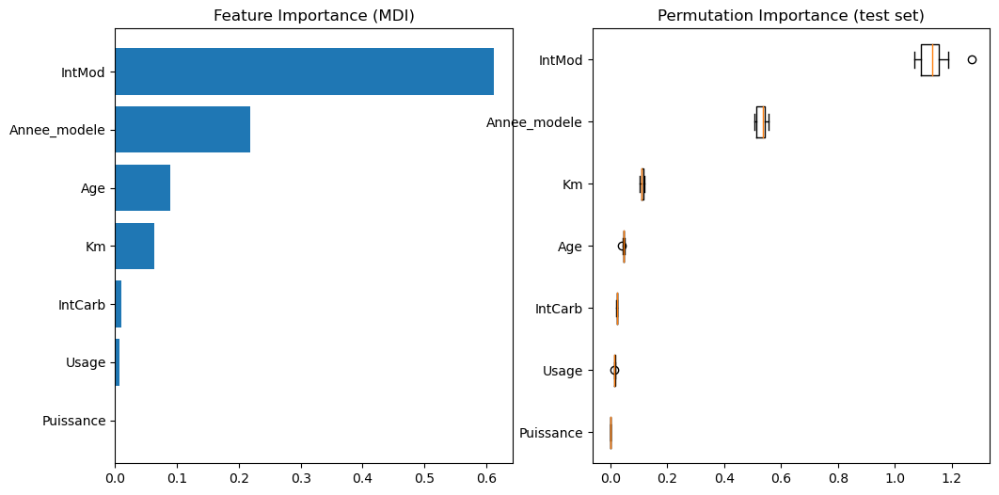

# AutoOccas - Estimation & Prediction of Used Car price

[](https://autooccas-z8nh4mysijavbyjsto5afu.streamlit.app/)

## Project
This project was developed in an autodidact manner, without external constrain. All suggestion are welcome.
The aim of this project was to answer at two problematics of the used car market:
1. **Estimate the correct price :** Estimate if an add overestimates the car price
2. **Anticipate the depreciation :** Predict the price of the car after 5 year the estimate the real usage cost of the car.

**Interactive app :** [Streamlit app](https://autooccas-z8nh4mysijavbyjsto5afu.streamlit.app/)


---

## Dataset
* **Source :** Kaggle, "Used-Car-DB" by Amir Aydin. Updated in 2024. https://www.kaggle.com/datasets/aydinamir/used-car-db?resource=download
* **Volume :** ~7000 add.
* **Key features :** Brand, Model, Date of production, Date of the model, Mileage, Energy, Horse Power, Used Price.

---

## Methodology

### 1. Data Cleaning & Feature Engineering
* Outliers detection: Car with anfeasible mileage, inconsistent age, wrong energy
* **Creation of new features :**
  * `Usage` : Average kilometers per year.
  * `Age` : Conversion of year of production.

### 2. Modelisation & Performances
Several regression algorithmes tried :
* **Baseline :** Linear Regression (score 0.95)
* **XGBoost Regressor (Selected) :** MAPE=0.05

---

## Results & Insights



* **Year of the model, age and mileage** Obviously the model of the car is the most important feature on the price variation (60%). The year of the model, the age of the car and the mileage represent almost the 40% remaining.
* **Dataset bias** The prices indicated in the data seems overestimated based on personal experience. The origin of these values is not indicated. Furthermore, the dataset was lastly updated in 2024, and thus doe not take into account recent events yielded strong depreciation of the price of Diesel cars.


---

## Launch project on local

1. **Clone project :**
   ```bash
   git clone [https://github.com/pouillyk/AutoOccas.git](https://github.com/pouillyk/AutoOccas.git)
   cd AutoOccas
   streamlit run streamlitMLAuto.py
